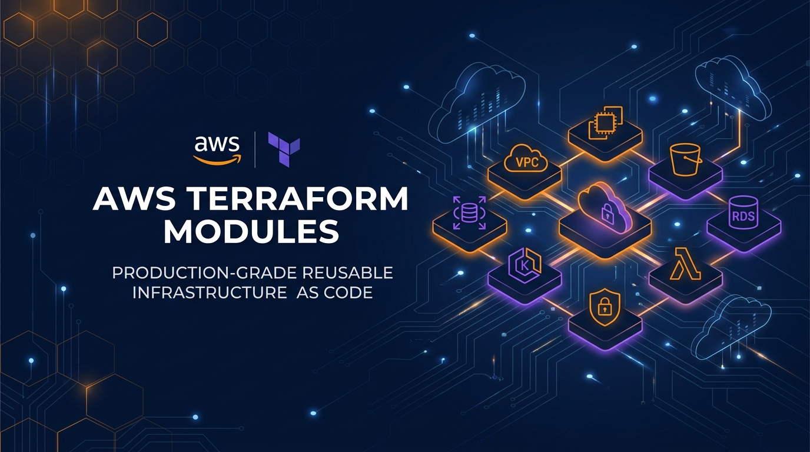
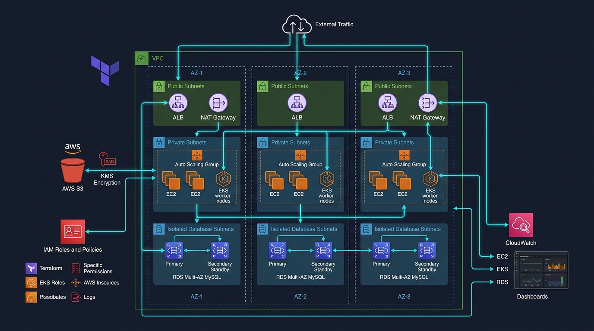
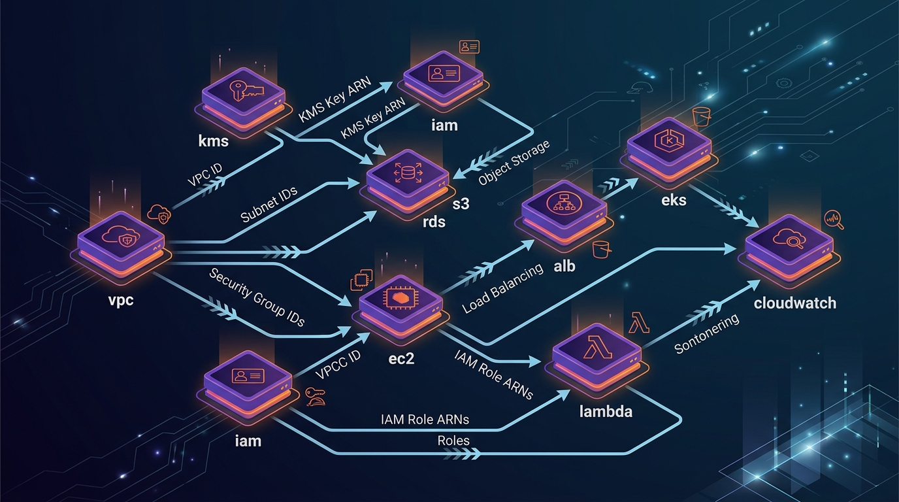
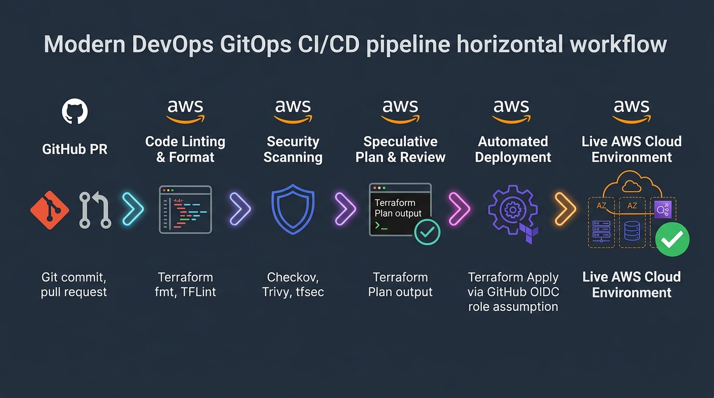

<div align="center">



# AWS Terraform Modules

### Enterprise-Grade, Reusable Infrastructure as Code (IaC) for Amazon Web Services

[](https://www.terraform.io/)
[](https://registry.terraform.io/providers/hashicorp/aws/latest)
[](.github/workflows/lint-and-validate.yml)
[](.github/workflows/security-scan.yml)
[](docs/security-best-practices.md)
[](LICENSE)

<p align="center">
  <a href="#-project-overview">Overview</a> •
  <a href="#-aws-architecture">Architecture</a> •
  <a href="#-repository-structure">Structure</a> •
  <a href="#-supported-modules">Modules</a> •
  <a href="#-full-stack-example">Full-Stack Example</a> •
  <a href="#-devops-cicd-pipeline">CI/CD & Automation</a> •
  <a href="#-security--well-architected">Security</a> •
  <a href="#-cost-optimization">FinOps</a> •
  <a href="#-quick-start">Quick Start</a>
</p>

---

</div>

## 📌 Project Overview

**`aws-terraform-modules`** is a battle-tested, modular Infrastructure as Code (IaC) library engineered to accelerate and standardize cloud engineering on Amazon Web Services (AWS). Designed by adhering strictly to the **AWS Well-Architected Framework**, **CIS AWS Foundations Benchmarks**, and modern **DevSecOps** automation practices, this repository enables engineers to provision scalable, compliant, multi-tier cloud architectures in minutes rather than weeks.

### ✨ Key Engineering Highlights

- 🔒 **Zero-Trust Security by Default**: KMS CMK automated rotation, S3 Bucket Keys, TLS 1.2/1.3 transport enforcement, private subnets, security group chaining, and IMDSv2 token enforcement on EC2 compute.
- 🧱 **True Composable Modularity**: Modules accept dependencies (VPC IDs, subnets, KMS keys, security groups) as inputs and export strictly scoped outputs—**zero hardcoded resource IDs**.
- 🚀 **Production-Ready & Tested**: All 10 modules and 5 real-world scenarios are validated using `terraform fmt`, `terraform validate`, TFLint, and automated security scans.
- ⚡ **Continuous GitOps Delivery**: Built-in GitHub Actions workflows for automated code linting, static security analysis (Trivy & Checkov), and passwordless AWS deployment via **GitHub Actions OIDC**.
- 💰 **Built-In FinOps Cost Optimization**: Automatic S3 Bucket Key optimization (99% KMS request fee reduction), configurable single vs multi-NAT Gateway topologies, and GP3 storage defaults.

---

## 🏛️ AWS Architecture

The diagram below depicts the reference multi-tier enterprise architecture orchestrated by combining the reusable modules:



```text
                                [ Internet Users ]
                                        │ (HTTPS / TLS 1.3)
                                        ▼
    ┌────────────────────────── Public Subnets ──────────────────────────┐
    │                                                                    │
    │   [ Application Load Balancer ]      [ NAT Gateways (Multi-AZ) ]   │
    │                  │                               │                 │
    └──────────────────┼───────────────────────────────┼─────────────────┘
                       │ (HTTP Forwarded)              │ (Outbound NAT)
                       ▼                               ▼
    ┌────────────────────────── Private Subnets ─────────────────────────┐
    │                                                                    │
    │   [ EC2 Auto Scaling / Workloads ]   [ EKS Managed Worker Nodes ]  │
    │   • IMDSv2 Enforced                  • K8s Secrets via KMS         │
    │   • gp3 Encrypted EBS Volumes        • IAM Roles for Service Accts │
    │   • IAM Instance Profiles (SSM)      • CloudWatch Logging          │
    │                  │                                                 │
    └──────────────────┼─────────────────────────────────────────────────┘
                       │ (Restricted Port 3306)
                       ▼
    ┌──────────────────────── Isolated Database Subnets ─────────────────┐
    │                                                                    │
    │   [ Amazon RDS Multi-AZ Database (MySQL / PostgreSQL) ]            │
    │   • Automated Daily Backups & Storage Autoscaling                  │
    │   • Dedicated DB Subnet Group & Ingress Chained to EC2 SG          │
    │                                                                    │
    └────────────────────────────────────────────────────────────────────┘
             │                                              ▲
             ▼ (SSE-KMS Encryption)                         │
    ┌───────────────────────── Shared Cloud Services ───────┴────────────┐
    │  [ AWS KMS ]              [ Amazon S3 ]             [ CloudWatch ] │
    │  • CMK Auto-Rotation      • Public Block Enabled    • Log Groups   │
    │  • Least-Privilege Policy • Bucket Keys (99% Save)  • Alarms & Dash│
    └────────────────────────────────────────────────────────────────────┘
```

---

## 🧩 Terraform Modules Ecosystem

The diagram below demonstrates how the decoupled modules interconnect cleanly through Terraform inputs and outputs:



---

## 📂 Repository Structure

```text
aws-terraform-modules/
├── modules/                         # Reusable core Terraform modules
│   ├── alb/                         # Application Load Balancer & Target Groups
│   ├── cloudwatch/                  # Log groups, metric alarms & dashboards
│   ├── ec2/                         # Hardened instances, EBS, SG & user-data
│   ├── eks/                         # EKS Cluster, node groups & IRSA OIDC
│   ├── iam/                         # Least-privilege roles, policies & profiles
│   ├── kms/                         # Customer Managed Keys with auto-rotation
│   ├── lambda/                      # Serverless functions, packaging & roles
│   ├── rds/                         # Multi-AZ databases, encryption & subnet groups
│   ├── s3/                          # Secure buckets, SSE-KMS & lifecycle rules
│   └── vpc/                         # 3-tier subnets, NAT, IGW & Flow Logs
├── examples/                        # Real-world deployment scenarios
│   ├── ec2-basic/                   # Standalone AL2023 web server
│   ├── full-stack/                  # Complete integrated 3-tier cloud infrastructure
│   ├── rds-mysql/                   # Isolated MySQL in private subnet group
│   ├── s3-secure/                   # KMS-encrypted bucket with lifecycle policies
│   └── vpc-public-private/          # Multi-AZ VPC with NAT & VPC Flow Logs
├── docs/                            # Deep-dive architecture & guides
│   ├── architecture.md              # Architectural blueprint & Well-Architected alignment
│   ├── cost-optimization.md         # FinOps guide & cost reduction strategies
│   ├── linkedin-announcement.md     # Ready-to-publish social showcase post
│   └── security-best-practices.md   # Defense-in-depth compliance documentation
├── images/                          # High-resolution architectural diagrams & banner
│   ├── architecture-diagram.png
│   ├── banner.png
│   ├── cicd-workflow.png
│   ├── social-preview.png
│   └── terraform-modules-diagram.png
├── .github/
│   └── workflows/
│       ├── lint-and-validate.yml    # CI: terraform fmt, validate & TFLint
│       ├── security-scan.yml        # CI: Trivy & Checkov static analysis
│       └── terraform-deploy.yml     # CD: PR plan preview & AWS OIDC deployment
├── .gitignore                       # Complete Terraform & OS ignore rules
├── CONTRIBUTING.md                  # Developer contribution guide
├── LICENSE                          # MIT License
└── README.md                        # Master repository documentation
```

---

## 📦 Supported AWS Modules

Each module is self-contained with its own `main.tf`, `variables.tf`, `outputs.tf`, `versions.tf`, and comprehensive `README.md`.

| Module | Description | Key Capabilities | Documentation |
|:-------|:------------|:-----------------|:--------------|
| [**`vpc`**](modules/vpc/) | 3-Tier Multi-AZ Network | Public, private, and isolated DB subnets, single/multi NAT Gateway options, VPC Flow Logs | [Read Guide](modules/vpc/README.md) |
| [**`kms`**](modules/kms/) | Encryption & Key Management | Customer Master Keys (CMK), automated annual rotation, aliases, root fallback policy | [Read Guide](modules/kms/README.md) |
| [**`iam`**](modules/iam/) | Identity & Governance | Assume role service bindings, inline/managed policies, EC2 instance profiles | [Read Guide](modules/iam/README.md) |
| [**`s3`**](modules/s3/) | Hardened Object Storage | Public Access Block, SSE-KMS + S3 Bucket Keys, enforced SSL bucket policy, lifecycle rules | [Read Guide](modules/s3/README.md) |
| [**`ec2`**](modules/ec2/) | Hardened Compute | IMDSv2 token enforcement, gp3 encrypted EBS volumes, AL2023 resolution, security groups | [Read Guide](modules/ec2/README.md) |
| [**`alb`**](modules/alb/) | Ingress Load Balancing | HTTP/HTTPS listeners, 301 HTTPS redirect, TLS 1.3 policy, header sanitization, health checks | [Read Guide](modules/alb/README.md) |
| [**`rds`**](modules/rds/) | Relational Database Service | MySQL/PostgreSQL, Multi-AZ, storage autoscaling, KMS encryption, dedicated subnet group | [Read Guide](modules/rds/README.md) |
| [**`eks`**](modules/eks/) | Managed Kubernetes | EKS 1.30, KMS secret envelope encryption, managed node groups, OIDC provider for IRSA | [Read Guide](modules/eks/README.md) |
| [**`lambda`**](modules/lambda/) | Serverless Compute | Automated archive packaging, VPC attachment, CloudWatch log retention, X-Ray tracing | [Read Guide](modules/lambda/README.md) |
| [**`cloudwatch`**](modules/cloudwatch/) | Observability & Telemetry | Log groups with expiration, metric alarms (CPU, 5XX, latency), operational dashboards | [Read Guide](modules/cloudwatch/README.md) |

---

## 🚀 Quick Usage Examples

### 1. VPC Network Module
```hcl
module "vpc" {
  source = "./modules/vpc"

  name       = "production"
  cidr_block = "10.0.0.0/16"
  azs        = ["us-east-1a", "us-east-1b"]

  public_subnets   = ["10.0.1.0/24", "10.0.2.0/24"]
  private_subnets  = ["10.0.10.0/24", "10.0.20.0/24"]
  database_subnets = ["10.0.30.0/24", "10.0.40.0/24"]

  enable_nat_gateway = true
  single_nat_gateway = false # Dedicated NAT per AZ for Multi-AZ production
}
```

### 2. Hardened S3 Bucket with KMS
```hcl
module "s3_bucket" {
  source = "./modules/s3"

  bucket_name        = "my-enterprise-audit-logs"
  versioning_status  = "Enabled"
  kms_master_key_id  = module.kms.key_arn
  bucket_key_enabled = true
  enforce_ssl        = true

  enable_lifecycle_rules             = true
  noncurrent_version_transition_days = 30
  noncurrent_version_expiration_days = 90
}
```

### 3. Application Load Balancer
```hcl
module "alb" {
  source = "./modules/alb"

  name    = "web-ingress"
  vpc_id  = module.vpc.vpc_id
  subnets = module.vpc.public_subnet_ids

  target_port       = 80
  target_protocol   = "HTTP"
  health_check_path = "/healthz"
}
```

---

## 🌟 Full-Stack Integrated Architecture

The [`examples/full-stack`](examples/full-stack/) scenario demonstrates end-to-end cloud orchestration, passing attributes cleanly between modules:

```hcl
# 1. Encryption
module "kms" {
  source      = "../../modules/kms"
  alias_name  = "prod-master-key"
}

# 2. Multi-AZ Network
module "vpc" {
  source           = "../../modules/vpc"
  name             = "prod-network"
  azs              = ["us-east-1a", "us-east-1b"]
  public_subnets   = ["10.0.1.0/24", "10.0.2.0/24"]
  private_subnets  = ["10.0.10.0/24", "10.0.20.0/24"]
  database_subnets = ["10.0.30.0/24", "10.0.40.0/24"]
}

# 3. Public Ingress Load Balancer
module "alb" {
  source  = "../../modules/alb"
  name    = "prod-alb"
  vpc_id  = module.vpc.vpc_id
  subnets = module.vpc.public_subnet_ids
}

# 4. Private Compute (Chained to ALB SG)
module "ec2_app" {
  source        = "../../modules/ec2"
  name          = "prod-web"
  vpc_id        = module.vpc.vpc_id
  subnet_id     = module.vpc.private_subnet_ids[0]
  instance_type = "t3.small"

  security_group_ingress_rules = [{
    description     = "Allow traffic from ALB SG only"
    from_port       = 80
    to_port         = 80
    protocol        = "tcp"
    security_groups = [module.alb.security_group_id]
  }]
}

# 5. Isolated Database (Chained to EC2 SG)
module "rds" {
  source                     = "../../modules/rds"
  name                       = "prod-mysql"
  vpc_id                     = module.vpc.vpc_id
  db_subnet_group_name       = module.vpc.database_subnet_group_name
  kms_key_id                 = module.kms.key_arn
  password                   = var.db_password
  allowed_security_group_ids = [module.ec2_app.security_group_id]
}
```

---

## 🔄 DevOps CI/CD & Automation

Every pull request and merge triggers our automated GitHub Actions workflow pipeline:



1. **Pull Request Validation**:
   - `terraform fmt -check -recursive`: Verifies clean HCL formatting.
   - `terraform validate`: Validates syntax, types, and resource schemas.
   - `TFLint`: Checks for AWS-specific best practices and deprecated arguments.
2. **Security & Compliance Auditing**:
   - **Trivy**: Scans for high and critical IaC misconfigurations.
   - **Checkov**: Validates configurations against CIS Benchmarks, NIST, and SOC2.
3. **Automated Plan Review**:
   - Runs speculative `terraform plan` and automatically posts formatted change summaries into the PR conversation.
4. **Keyless AWS Deployment (OIDC)**:
   - Eliminates long-lived static AWS access keys by exchanging ephemeral GitHub Actions JWT tokens for temporary AWS STS credentials via IAM OIDC federation.

---

## 🔒 Security Best Practices Implemented

- **SSRF Mitigation with IMDSv2**: All EC2 launch configurations and instances enforce `http_tokens = "required"` and restrict hop limit to 1.
- **Envelope Encryption**: Kubernetes secrets in EKS and tables in RDS are encrypted with Customer Managed Keys.
- **Enforced Transport Security**: S3 bucket policies reject unencrypted HTTP requests (`aws:SecureTransport = false`).
- **Zero Ingress to Databases**: RDS resides in subnets with zero internet route table entries; security groups strictly permit the application tier.
- **Least-Privilege Roles**: Execution and instance roles contain no wildcard admin permissions.

*For complete details, see the [Security & Compliance Guide](docs/security-best-practices.md).*

---

## 💰 FinOps & Cost Optimization

- **S3 Bucket Keys**: Enabled on all S3 buckets, reducing KMS API requests by **up to 99%**.
- **Flexible NAT Topologies**: Toggle `single_nat_gateway = true` for dev/staging environments to eliminate redundant \$32/mo NAT charges per AZ.
- **GP3 Storage**: 20% cheaper than GP2 with decoupled, baseline 3,000 IOPS performance.
- **Graviton Ready**: Default RDS instances leverage `db.t4g` Graviton instances for 40% better price-performance.
- **CloudWatch Expiration**: Enforces explicit 14-30 day log retention to stop unbounded storage bills.

*For complete details, see the [FinOps Optimization Guide](docs/cost-optimization.md).*

---

## 🛠️ Quick Start & Local Execution

### Prerequisites

- [Terraform](https://developer.hashicorp.com/terraform/downloads) `>= 1.5.0`
- [AWS CLI](https://aws.amazon.com/cli/) `>= 2.0` configured with proper IAM credentials
- [Git](https://git-scm.com/)

### Step-by-Step Deployment

1. **Clone the repository:**
   ```bash
   git clone https://github.com/YOUR_USERNAME/aws-terraform-modules.git
   cd aws-terraform-modules
   ```

2. **Navigate to the desired example (e.g. full-stack):**
   ```bash
   cd examples/full-stack
   ```

3. **Configure input variables:**
   ```bash
   cp terraform.tfvars.example terraform.tfvars
   # Edit terraform.tfvars with your preferred parameters
   ```

4. **Initialize Terraform:**
   ```bash
   terraform init
   ```

5. **Generate and review the execution plan:**
   ```bash
   terraform plan
   ```

6. **Apply configuration:**
   ```bash
   terraform apply
   ```

7. **Clean up when finished:**
   ```bash
   terraform destroy
   ```

---

## 🤝 Contributing

Contributions, issues, and feature requests are welcome!
Please check our [Contributing Guide](CONTRIBUTING.md) and [Architecture Documentation](docs/architecture.md) before submitting a pull request.

---

## 📄 License

This project is licensed under the MIT License - see the [LICENSE](LICENSE) file for details.

---

<div align="center">

**Developed with ❤️ for Cloud Architects, DevOps Engineers, and the Open-Source Community.**

⭐ *If you find this repository valuable, please consider giving it a star on GitHub!* ⭐

</div>
